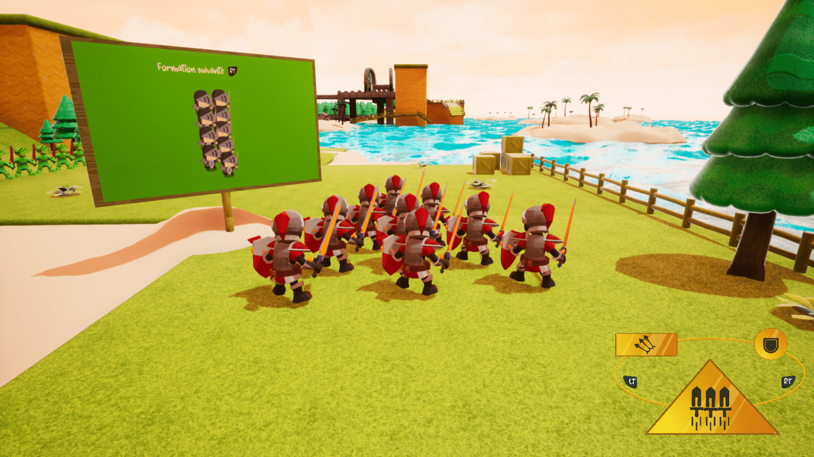
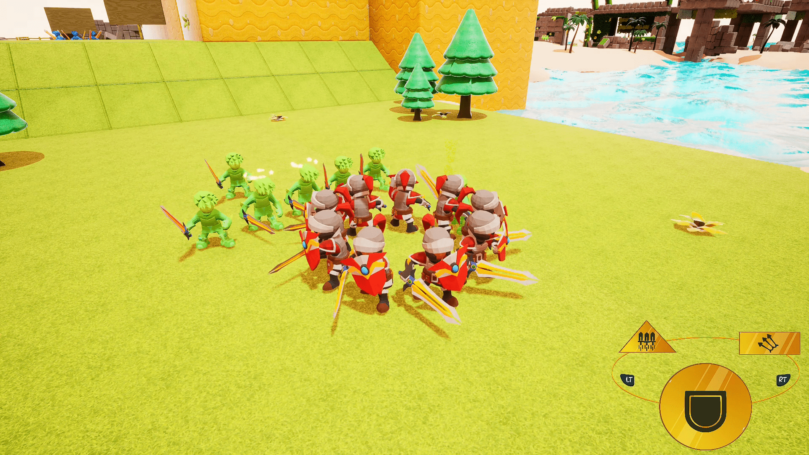
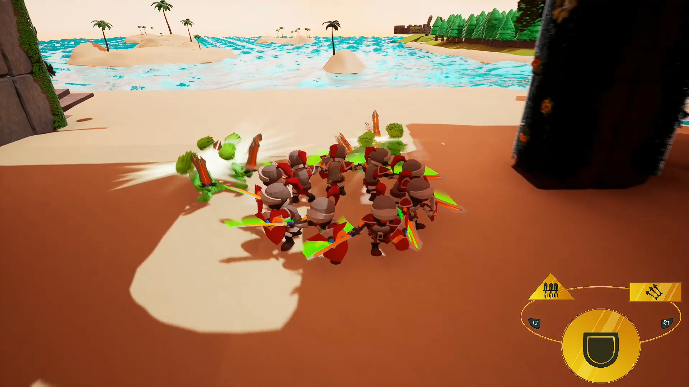
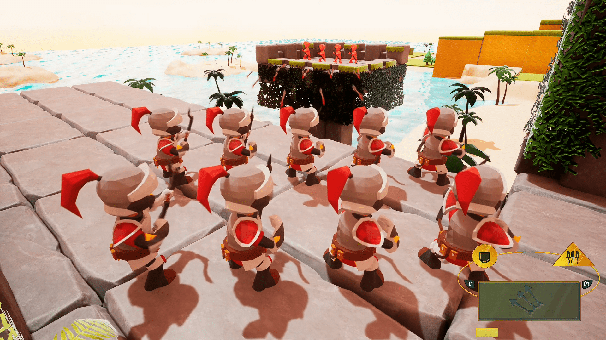
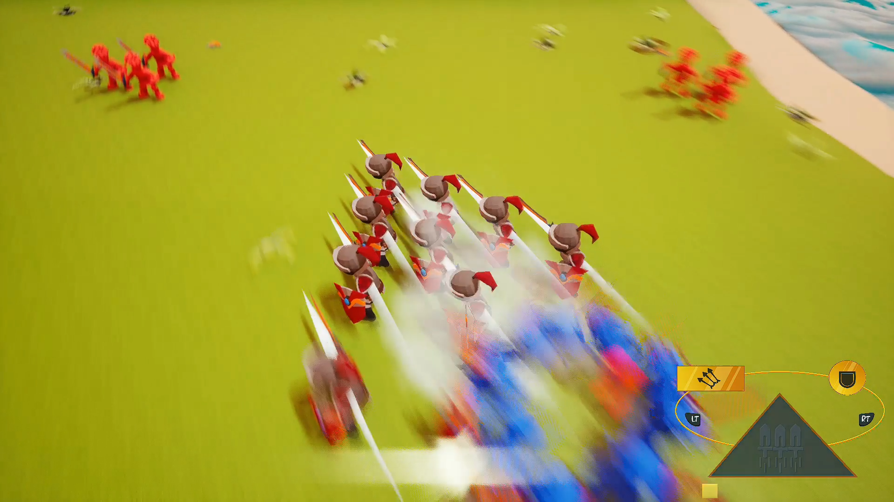
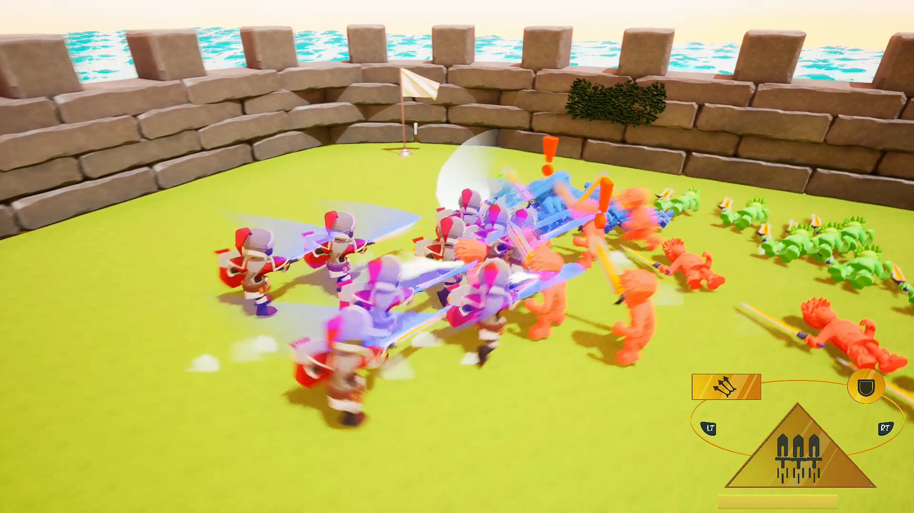

# Mini Company

        
 <a href="https://www.youtube.com/watch?v=oyDPEQYcDxI">Low-resolution gameplay footage</a>

 
### Credits
| Name                      | Role              |
|---------------------------|-------------------|
| AYRAL Malo                | Game Designer     |
| JALLIFFIER-MERLON Jules   | Game Designer     |
| LECACHEUR Anthony         | Game Designer     |
| AMARA Sami                | Game Programmer   |
| PETIT Denis               | Game Programmer   |
 
## Description
Mini Company is a single player third-person brawler game.  
Play as a group of 9 brave knights, sent to a stranded island overturned by mean knights.  
Defeat the enemies by assuming 3 different tactical combat formations, which are up to you to discover! 

## Playing
You can either:
- [download a build](https://github.com/Bad-Sam/mini_company/releases) (mirror [here](https://jules-jalliffier-merlon.itch.io/mini-company)) and run `MiniCompany.exe` in the archive
- open the project in Unreal Engine 4 and play directly in the editor

## Controls
Gamepad:
| Input                 | Action                |
|-----------------------|-----------------------|
| Left face button      | Attack                |
| Right face button     | Block                 |
| Bottom face button    | Jump                  |
| Top face button       | Special attack        |
| Left joystick         | Move company          |
| Right joystick        | Move camera           |
| Left trigger          | Previous formation    |
| Right trigger         | Next formation        |
| Right shoulder        | Lock camera           |
