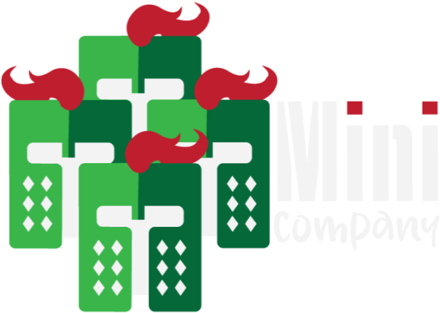

# Mini Company
<div align="center" ></div>
<div align="center">
    <p></p>
         
</div>
<div align="center">
    <a href="https://jules-jalliffier-merlon.itch.io/mini-company">itch.io 1</a> | <a href="https://anthonylecacheur.itch.io/mini-company">itch.io 2</a> | <a href="https://www.youtube.com/watch?v=oyDPEQYcDxI">Low-resolution gameplay footage</a>
</div>

 
## Description
Mini Company is a single player third-person brawler game.  
Play as a group of 9 brave knights, sent to a stranded island overturned by mean knights.  
Defeat the enemies by assuming 3 different tactical combat formations, which are up to you to discover! 


## Playing
To play the game, you can either:
- [download a build](https://github.com/Bad-Sam/mini_company/releases) and run `MiniCompany.exe` in the archive
- clone this repository, open the project in Unreal Engine 4.24+ and play in the editor:  
```git clone https://github.com/Bad-Sam/mini_company.git && cd mini_company```


## Controls
Mini Company was thought to be played on a gamepad


| Input                 | Action                |
|-----------------------|-----------------------|
| Left face button      | Attack                |
| Right face button     | Block                 |
| Bottom face button    | Jump                  |
| Top face button       | Special attack        |
| Left joystick         | Move company          |
| Right joystick        | Move camera           |
| Left trigger          | Previous formation    |
| Right trigger         | Next formation        |
| Right shoulder        | Lock camera           |


## Credits
| Name                      | Role              |
|---------------------------|-------------------|
| AYRAL Malo                | Game Designer     |
| JALLIFFIER-MERLON Jules   | Game Designer     |
| LECACHEUR Anthony         | Game Designer     |
| AMARA Sami                | Game Programmer   |
| PETIT Denis               | Game Programmer   |
